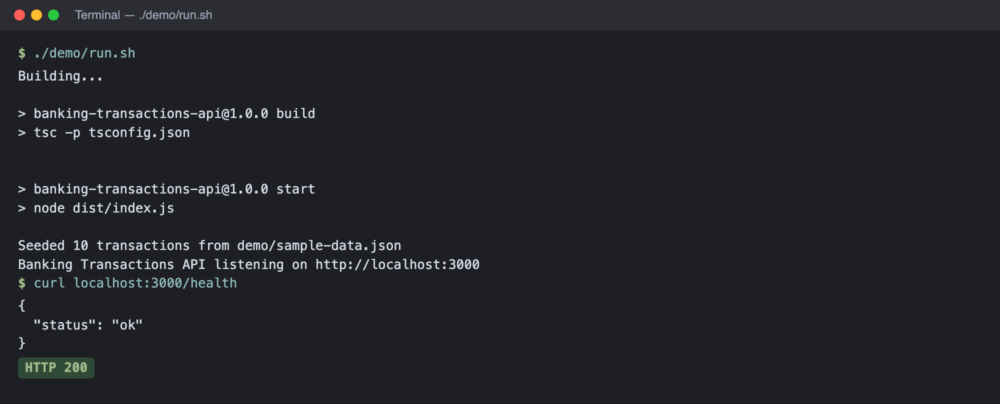
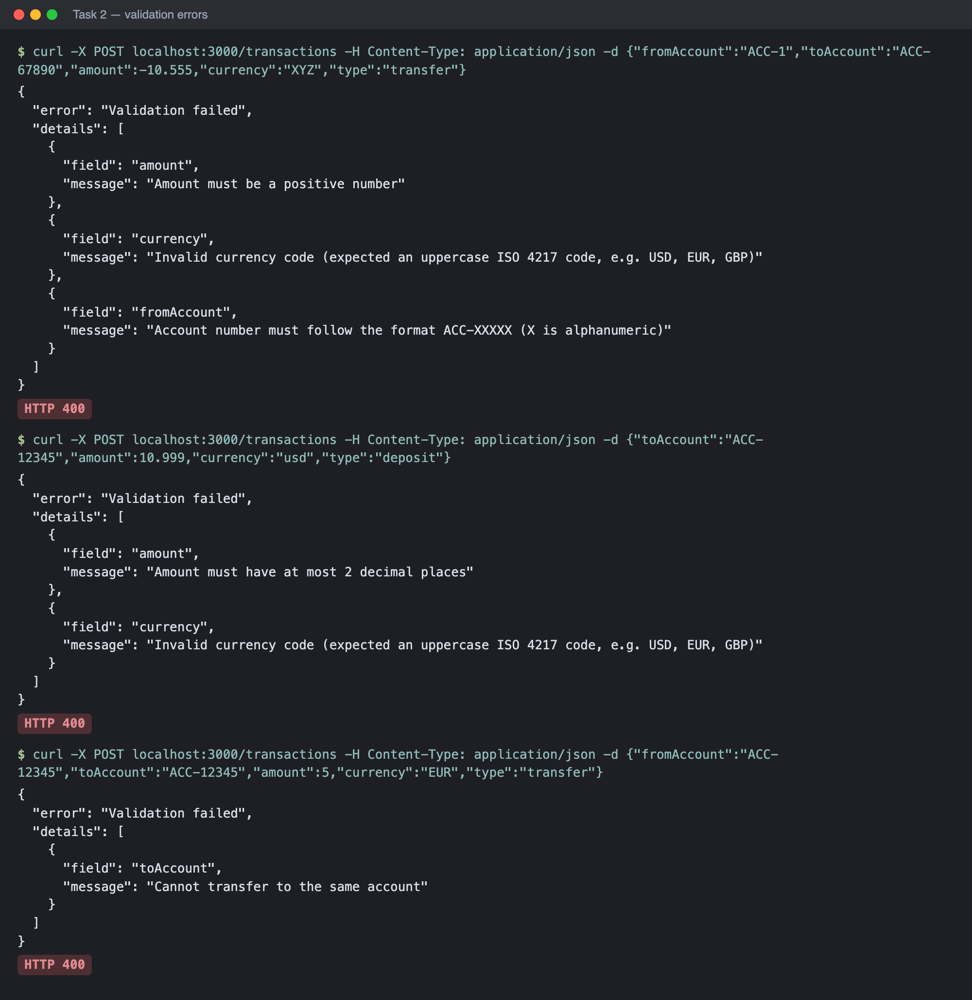

# 🏦 Homework 1: Banking Transactions API

> **Student Name**: Slipoy
> **Date Submitted**: 2026-09-29
> **AI Tools Used**: Claude Code (Claude Opus 5.5, Claude desktop app)

---

## 📋 Project Overview

A minimal REST API for banking transactions written in **TypeScript + Express 5**, with in-memory storage.
It supports deposits, withdrawals and transfers between accounts in any ISO 4217 currency, validates every
request, calculates balances, and filters the transaction history.

All four tasks are implemented, including **all four** optional features from Task 4:

| Task | Status | Where |
|------|--------|-------|
| 1. Core API (`POST/GET /transactions`, `GET /transactions/:id`, `GET /accounts/:id/balance`) | ✅ | [`src/routes`](src/routes) |
| 2. Validation (amount, account format, ISO 4217 currency, error format) | ✅ | [`src/validators/transactionValidator.ts`](src/validators/transactionValidator.ts) |
| 3. Filtering by account, type, date range, combined | ✅ | `TransactionService.list()` |
| 4A. Account summary `GET /accounts/:id/summary` | ✅ | `TransactionService.summary()` |
| 4B. Simple interest `GET /accounts/:id/interest?rate=&days=` | ✅ | `TransactionService.interest()` |
| 4C. CSV export `GET /transactions/export?format=csv` | ✅ | [`src/utils/csv.ts`](src/utils/csv.ts) |
| 4D. Rate limiting (100 req/min per IP → `429`) | ✅ | [`src/middleware/rateLimiter.ts`](src/middleware/rateLimiter.ts) |
| Tests (not required) | ✅ 39 tests | [`tests/api.test.ts`](tests/api.test.ts) |

How to run it: see **[HOWTORUN.md](HOWTORUN.md)**.

---

## 🔌 API Reference

Base URL: `http://localhost:3000`

| Method | Endpoint | Success | Errors |
|--------|----------|---------|--------|
| `POST` | `/transactions` | `201` + created transaction, `Location` header | `400` validation |
| `GET` | `/transactions?accountId=&type=&from=&to=` | `200` array | `400` invalid filter |
| `GET` | `/transactions/:id` | `200` transaction | `404` |
| `GET` | `/transactions/export?format=csv` (+ same filters) | `200` `text/csv` attachment | `400` |
| `GET` | `/accounts/:accountId/balance` | `200` `{ accountId, balances }` | `400` bad id, `404` unknown account |
| `GET` | `/accounts/:accountId/summary` | `200` summary | `400`, `404` |
| `GET` | `/accounts/:accountId/interest?rate=0.05&days=30` | `200` interest per currency | `400`, `404` |
| `GET` | `/health` | `200` `{ status: "ok" }` | |

Every response may also be `429 Too Many Requests` once a client exceeds 100 requests per minute.

### Transaction model

```json
{
  "id": "0e729d88-ea0f-445e-bb77-750c6405114f",
  "fromAccount": "ACC-12345",
  "toAccount": "ACC-67890",
  "amount": 100.5,
  "currency": "USD",
  "type": "transfer",
  "timestamp": "2024-01-10T14:45:00.000Z",
  "status": "completed"
}
```

`failureReason` is added only when `status` is `failed`.

### Validation rules

| Field | Rule |
|-------|------|
| `amount` | Number, `> 0`, at most 2 decimal places (`10.5` ✅, `10.555` ❌, `"10"` ❌) |
| `fromAccount` / `toAccount` | `ACC-` + exactly 5 letters or digits (`ACC-12345`, `ACC-AB12z`) |
| `currency` | Uppercase ISO 4217 code known to the runtime (`USD`, `EUR`, `GBP`, `JPY`, … 160+ codes) |
| `type` | `deposit` \| `withdrawal` \| `transfer` |
| accounts per type | deposit → `toAccount` only; withdrawal → `fromAccount` only; transfer → both, and they must differ |

All errors are returned at once, in the format required by the task:

```json
{
  "error": "Validation failed",
  "details": [
    { "field": "amount", "message": "Amount must be a positive number" },
    { "field": "currency", "message": "Invalid currency code (expected an uppercase ISO 4217 code, e.g. USD, EUR, GBP)" }
  ]
}
```

---

## 🏗️ Architecture Decisions

```
src/
├── index.ts                       # Entry point: optional seeding + app.listen()
├── app.ts                         # createApp(): middleware, routers, 404 + error handler
├── models/transaction.ts          # Types and enums
├── validators/transactionValidator.ts  # Body + query validation, collects all errors
├── services/transactionService.ts # Business logic: create, filter, balance, summary, interest
├── store/transactionStore.ts      # In-memory Map (the only place that holds data)
├── routes/                        # Thin HTTP layer: parse → validate → call service → respond
├── middleware/rateLimiter.ts      # Fixed-window limiter per IP
└── utils/                         # money (cents math), csv, http error helpers
```

1. **Layered design (routes → service → store).** Routes only deal with HTTP; the service holds the
   rules; the store is the only stateful part. Replacing the in-memory `Map` with a database means
   rewriting one small class.
2. **`createApp()` factory instead of a global app.** Tests build a fresh app with its own store and
   with rate limiting disabled, so tests are isolated and fast (no real port is opened).
3. **Money is calculated in integer cents.** Summing floats gives `0.1 + 0.2 = 0.30000000000000004`;
   converting to cents first keeps balances exact (covered by a test).
4. **Balances are per currency.** A transaction has its own currency and there is no exchange-rate
   service, so `balance`, `summary` and `interest` return `{ "USD": 1374, "EUR": 199.5 }` instead of
   mixing currencies into one number.
5. **Insufficient funds → `status: "failed"`, not an HTTP error.** The request itself is valid, so the
   API returns `201` and keeps the attempt for audit with a `failureReason`. Failed transactions never
   affect balances. Transactions are processed synchronously, so `pending` exists in the model but is
   never produced.
6. **Account "exists" once it appears in a transaction.** There is no account registry in the task,
   so `/accounts/:id/*` returns `404` for an account with no history and `400` for a malformed id.
7. **Hand-written validation instead of a schema library.** The task prescribes an exact error format
   and messages; a small explicit validator made that simpler than mapping a library's error format,
   and it reports all problems in one response.
8. **Date filters.** `from`/`to` accept `YYYY-MM-DD` or full ISO 8601. A date-only `to` means the end of
   that day (UTC), so `?from=2024-01-01&to=2024-01-31` includes transactions made on January 31.
9. **Interest** uses `balance × rate × days / 365` with an annual `rate` between 0 and 1, rounded to
   cents; negative or zero balances earn nothing.
10. **Rate limiter** is a fixed window in memory with `X-RateLimit-*` and `Retry-After` headers.
    It is fine for one process; multiple instances would need a shared store such as Redis.

---

## 🤖 How AI Was Used

The whole project was built in a conversation with **Claude Code** (Claude Opus 5.5) in the Claude desktop
app. I acted as the reviewer and decision maker; Claude wrote the code, tests and docs and ran them.

Workflow:

1. **Understanding the assignment.** Claude read `TASKS.md` from GitHub and the lecture recording
   transcript (from 1:43) to collect requirements that were only said out loud: fork + branch + detailed PR
   with embedded screenshots.
2. **Setup.** Claude checked that GitHub CLI was authenticated, forked the repository to my account, cloned
   it and created the `homework-1-submission` branch.
3. **Choosing the stack.** Claude compared Python/FastAPI and Node/TypeScript, noting that homework 2 only
   allows Node/Express, Python or Java. I chose Node + TypeScript.
4. **Implementation.** Claude proposed the layered structure and wrote the code. It dropped `zod` after
   installing it because hand-written validation matched the required error format more directly.
5. **Verification.** Claude ran `tsc` in strict mode, wrote 39 tests (vitest + supertest), started the
   server with demo data and ran every sample request. It checked balances by recalculating them by hand
   (e.g. `1500 − 320.75 + 45.25 − 100.5 + 250 = 1374`).
6. **Documentation.** Claude wrote README, HOWTORUN, demo scripts and took screenshots of the running API.

Key prompts:

- *"Can you take the transcript from the Google Drive recording? From 1:46 he talks about the homework."*
- *"Can we do this assignment: fork it to my account and keep working there?"*
- *"Let's use Node/TypeScript."*

Things I had to decide or correct myself: the stack, the git author for this repository, and where the PR
goes (into my fork, as the course README requires). The design decisions above (per-currency balances,
`failed` status for insufficient funds) were proposed by the AI and accepted after review.

---

## 📸 Screenshots

All screenshots are in [`docs/screenshots/`](docs/screenshots). Outputs are real responses from the running API
(started with `./demo/run.sh`, seeded with `demo/sample-data.json`).

| # | What it shows |
|---|---------------|
| [01](docs/screenshots/01-api-running.png) | API started with `./demo/run.sh`, health check |
| [02](docs/screenshots/02-create-and-balance.png) | Task 1: transfer `201`, overdraft stored as `failed`, balance, `404` |
| [03](docs/screenshots/03-validation.png) | Task 2: validation errors with all failing fields |
| [04](docs/screenshots/04-filters.png) | Task 3: combined filters and invalid filter `400` |
| [05](docs/screenshots/05-summary-interest.png) | Options A & B: summary and simple interest |
| [06](docs/screenshots/06-export-csv.png) | Option C: CSV export with `Content-Disposition` |
| [07](docs/screenshots/07-rate-limit.png) | Option D: `429` after the limit (earlier requests in the same minute count too) |
| [08](docs/screenshots/08-tests.png) | 39 passing tests and a clean type check |




---

<div align="center">

*This project was completed as part of the AI-Assisted Development course.*

</div>
