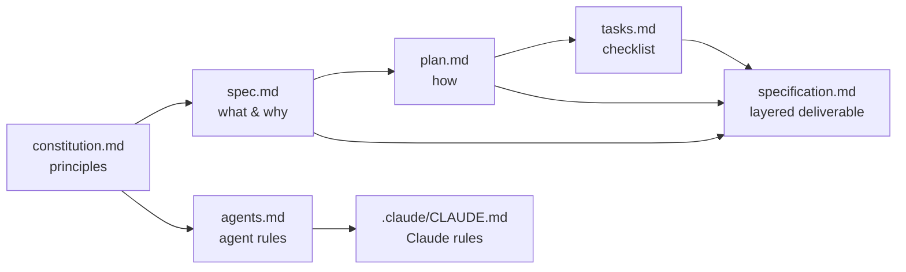

# Homework 3: Specification-Driven Design — Virtual Card Lifecycle

> **Student Name**: Slipoy
> **Date Submitted**: 2026-10-05
> **AI Tools Used**: Claude Code (Claude Opus), GitHub Spec Kit 1.1

## Task summary

A specification package for a **virtual debit card lifecycle** in a regulated bank: cardholders
issue cards, freeze/unfreeze them, set limits, see transactions, reveal full details after strong
authentication and close cards; ops and compliance staff search cards, apply blocks, approve
risky actions with four-eyes control and read an immutable audit trail. No code: only the
specification, agent rules and this README.

## What is where

| File | Purpose |
|---|---|
| [specification.md](specification.md) | **Main deliverable.** Layered spec: objectives, NFRs, implementation notes, context, diagrams, edge cases, verification, 43 low-level tasks, traceability |
| [agents.md](agents.md) | Rules for any AI coding agent: stack, banking rules, code style, testing, edge-case handling |
| [.claude/CLAUDE.md](.claude/CLAUDE.md) | Claude Code rules: imports `agents.md`, adds workflow, naming, FinTech defaults, what to avoid |
| [.specify/memory/constitution.md](.specify/memory/constitution.md) | 7 non-negotiable principles every artifact is checked against |
| [specs/001-virtual-card-lifecycle/](specs/001-virtual-card-lifecycle/) | Spec Kit trail: `spec.md` (what/why), `plan.md` (how), `tasks.md` (checklist), quality checklist |
| `.claude/skills/speckit-*`, `.specify/templates` | Spec Kit tooling installed by `specify init` |



## How it was produced

Following the workshop's Specify → Plan → Tasks → Implement → Validate cycle with Spec Kit:

1. `specify init --here --integration claude` installed templates and `/speckit-*` skills.
2. `/speckit-constitution` → 7 principles (money exactness, no card data, idempotency, append-only
   audit, explicit state machine, least privilege, spec as source of truth).
3. `/speckit-specify` → 7 prioritized user stories with Given/When/Then, 24 functional requirements,
   success criteria; quality checklist passed.
4. `/speckit-clarify` → 5 decisions recorded in the spec (limit time zone, freeze during processor
   outage, who may unfreeze, approval expiry, amount precision).
5. `/speckit-plan` → stack, constitution gate, state table, data model, API contract.
6. `/speckit-tasks` → 43 tasks grouped by user story.
7. The layered `specification.md` was assembled from these artifacts and the course template, then
   cross-checked: every objective maps to requirements, edge cases, tasks and a verification method.

Model choice followed the lecture advice: a strong reasoning model for the constitution, spec and
plan (where thinking about cases matters and text volume is small); the detailed tasks are written so a
cheaper model could implement them without guessing.

## Rationale

- **Layered on purpose.** High-level objective → mid-level objectives → NFRs → implementation notes →
  context → tasks. Each layer answers a different reader: product (objectives), compliance (NFR,
  audit, edge cases), engineers and agents (notes, tasks).
- **Observable objectives.** Each `OBJ-n` says what changes in the world ("next authorization after a
  freeze is declined"), so it can be tested, not argued about.
- **Traceability.** IDs everywhere (`OBJ`, `FR`, `NFR`, `EC`, `T`, `V`) and a matrix in §11, so a
  reviewer can follow a goal down to a task and back.
- **Restrictions as overlays, not states.** Real cards can be frozen by the user and blocked by
  fraud at the same time; an overlay model avoids "unfreeze accidentally lifts a fraud block".
- **Real-time authorization.** Freeze and limits are enforced by our own decision on each payment, so
  "freeze works instantly" is a guarantee, not a hope about sync lag.
- **Performance targets.** All numbers are labelled *assumed targets* with a reason next to each
  (§4.2): the 300 ms p99 authorization budget comes from the ~1–2 s processors give issuers; 200 /
  1,000 req/s from 20M transactions per month with a 5× peak; 300 / 500 ms from mobile UX
  expectations; 5 s back-office freshness from an acceptable outbox lag.
- **Verification depth.** Money and state rules are cheap to test exhaustively (table-driven and
  property tests); concurrency and idempotency need a real database; compliance needs human sign-off.
  So verification mixes automated layers with one manual compliance review (V-7) and a daily
  reconciliation (V-5) that keeps checking after launch.
- **Edge cases with consequences.** Every case states what the user sees and what the audit trail
  records, because in a regulated product the second matters as much as the first.

## Industry best practices and where they appear

| Practice | Where |
|---|---|
| PCI DSS scope minimization (no PAN/CVV, processor-hosted reveal, masked display) | Constitution II; specification §4.1 NFR-1/2, §5 Logging; agents.md Banking rules |
| Strong customer authentication (PSD2) for sensitive actions | Constitution VI; spec US5; specification NFR-2, T006, T027 |
| Idempotency keys for every write and partner call | Constitution III; specification §5 Idempotency, T007, EC-007 |
| Append-only, hash-chained audit with DB-level enforcement | Constitution IV; specification NFR-6/7, T008, T009, V-5 |
| Four-eyes (maker-checker) approvals | Constitution VI; specification NFR-5, EC-012/013, T034, diagram §7 |
| Money as integer minor units with ISO 4217 | Constitution I; specification §5 Money, T004 |
| Optimistic concurrency with versions | Constitution V; specification §5 Concurrency, EC-001, T011 |
| Transactional outbox for reliable events | Plan R-3; specification §5 Events, T010 |
| RFC 9457 problem details with stable error codes | Plan API contract; specification §5 Errors, T005 |
| Cursor pagination | Plan R-4; specification NFR-17, T025 |
| Least privilege, existence hiding (404 for others' cards) | Constitution VI; specification NFR-4, EC-010 |
| GDPR minimization and pseudonymization on erasure | Constitution constraints; specification NFR-8 |
| Contract testing with the partner | specification V-6, T040 |
| Fail-safe defaults (decline on timeout, stand-in) | Plan R-5; specification EC-009; agents.md edge cases |
| Reconciliation as a continuous control | specification V-5, T035 |

## How to continue with this package

```bash
uv tool install specify-cli --from git+https://github.com/github/spec-kit.git
cd homework-3 && claude   # then: /speckit-analyze, /speckit-implement
```
