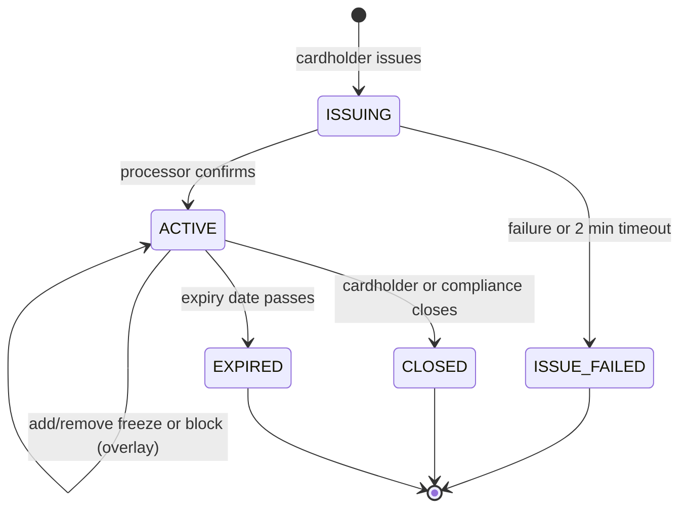
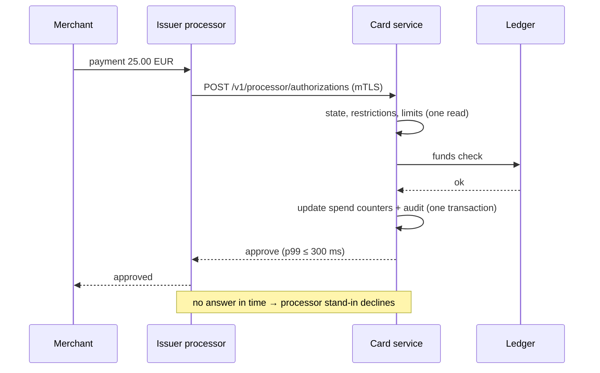
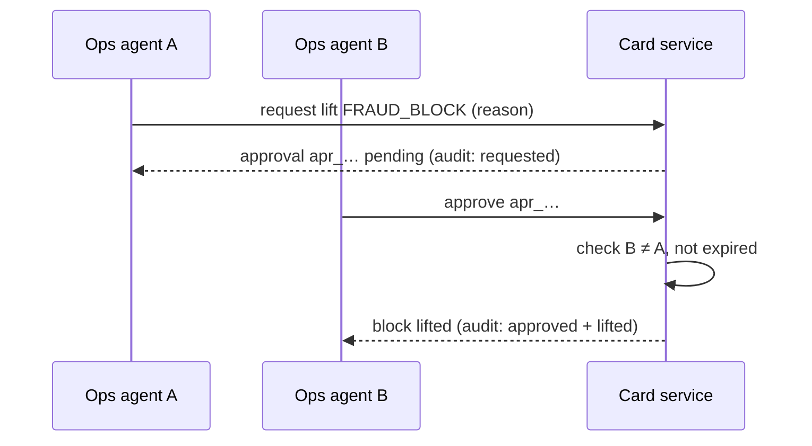

# Virtual Card Lifecycle — Specification

> Ingest the information from this file, implement the Low-Level Tasks, and generate the code that
> will satisfy the High and Mid-Level Objectives.

| | |
|---|---|
| Version | 1.0.0 (2026-10-05) |
| Status | Ready for implementation (documentation-only homework) |
| Governing rules | [constitution](.specify/memory/constitution.md), [agents.md](agents.md) |
| Spec Kit trail | [spec](specs/001-virtual-card-lifecycle/spec.md) → [plan](specs/001-virtual-card-lifecycle/plan.md) → [tasks](specs/001-virtual-card-lifecycle/tasks.md) |

## 1. High-Level Objective

Let a bank's customers create and control virtual debit cards themselves (issue, freeze, limit,
reveal, close, review spending) while the bank keeps every action auditable, card data outside its
own systems, and high-risk actions under four-eyes control.

**Scope boundary**: virtual debit cards in a single currency per card, for already-verified
customers; physical cards, credit, multi-currency, disputes and onboarding are out of scope.

## 2. Stakeholders

| Stakeholder | Needs | Primary objectives |
|---|---|---|
| Cardholder | Instant self-service control, clear reasons for declines | OBJ-1 to OBJ-5 |
| Ops agent | Find a card fast, act on approvals | OBJ-6 |
| Compliance officer | Complete, immutable trail; control of blocks | OBJ-6, OBJ-7 |
| Fraud system | Block cards automatically, receive risk signals | OBJ-2, OBJ-6 |
| Issuer processor (partner) | Fast, correct authorization answers; idempotent calls | OBJ-2, OBJ-8 |
| Security / PCI team | PAN never in bank systems | OBJ-5, OBJ-7 |

## 3. Mid-Level Objectives

Each objective is observable: it describes what changes in the world when it succeeds.

| ID | Objective (observable outcome) | Spec refs | Verified by |
|---|---|---|---|
| OBJ-1 | A verified cardholder gets a usable virtual card in ≤ 10 s (p95), never two cards from one request, never more than 5 open cards | FR-001–003, SC-001, SC-006 | V-1, V-5 |
| OBJ-2 | A freeze or bank block stops new payments on the next authorization; unfreeze restores them; restrictions never cancel each other | FR-004–008, SC-002 | V-1, V-2, V-3 |
| OBJ-3 | Payments above per-transaction, daily or monthly limits are declined with the exact reason; limits above policy wait for approval | FR-009–011 | V-1, V-2 |
| OBJ-4 | Cardholders see every payment attempt with status and human-readable decline reason, newest first, page by page | FR-012–013, SC-003 | V-2, V-4 |
| OBJ-5 | Full card details are seen only by the cardholder, after SCA, ≤ 60 s, ≤ 5 times/hour, and appear nowhere else | FR-014–016, SC-004 | V-3, V-6 |
| OBJ-6 | Staff find any card in ≤ 30 s and can block it; lifting blocks and over-ceiling limits needs a second person | FR-018–021, SC-007 | V-2, V-7 |
| OBJ-7 | Every change and sensitive attempt has exactly one immutable audit event; daily reconciliation finds 0 gaps | FR-022–023, SC-005 | V-5, V-7 |
| OBJ-8 | The service meets its latency, throughput and availability budgets (section 4.2) | SC-001–003 | V-4 |

## 4. Non-Functional Requirements and Policy

### 4.1 Security, privacy, audit

| ID | Requirement | Target |
|---|---|---|
| NFR-1 | PAN / CVV storage and logging | Never stored, logged, traced or returned by our API; only processor token, last4, expiry |
| NFR-2 | Reveal of card details | Processor-hosted, token valid 60 s, SCA required, 5 per card per hour |
| NFR-3 | Transport and storage | TLS 1.2+; mTLS with processor; AES-256 at rest; secrets from secret manager only |
| NFR-4 | Authorization | Scopes per role (cardholder, ops, compliance, fraud); cardholder sees only own cards (others → 404) |
| NFR-5 | Four-eyes | Lifting fraud/compliance blocks and limits above ceiling need approver ≠ requester; requests expire in 72 h |
| NFR-6 | Audit completeness | 100% of state changes, limit changes, reveals, approvals and denied sensitive attempts audited |
| NFR-7 | Audit immutability | DB role for the app has INSERT/SELECT only on `audit_events`; per-card hash chain; 7-year retention (assumed) |
| NFR-8 | Privacy (GDPR) | Data minimization; erasure = pseudonymize personal fields, audit kept for legal retention |
| NFR-9 | Log hygiene | Structured JSON logs, card shown as `**** 1234`, correlation id on every line; automated PAN scan in CI and on log samples |

### 4.2 Reliability and performance

All numbers are **assumed targets** for a mid-size digital bank (500k cardholders, 1.5M cards,
20M card transactions per month). Rationale is given per line.

| ID | Metric | Target | Why this number |
|---|---|---|---|
| NFR-10 | Authorization decision latency | p95 ≤ 150 ms, p99 ≤ 300 ms, hard timeout 800 ms | Processors give issuers ~1–2 s; budget leaves room for network and one retry |
| NFR-11 | Authorization throughput | 200 req/s sustained, 1,000 req/s peak for 15 min | 20M/month ≈ 8 req/s average; 5× peak days and growth headroom |
| NFR-12 | Cardholder reads | Card list and transaction page p95 ≤ 300 ms | Mobile screens feel instant under ~300 ms |
| NFR-13 | Cardholder writes | Freeze, unfreeze, limits, close p95 ≤ 500 ms | User waits on a spinner; above 1 s feels broken |
| NFR-14 | Issuance | p95 ≤ 5 s synchronous; 99.9% complete or fail ≤ 2 min | Partner usually instant; queue covers short outages |
| NFR-15 | Freeze effectiveness | Next authorization after a confirmed freeze is declined (read-your-writes on card state) | A freeze is a security control; no eventual consistency allowed |
| NFR-16 | Back-office freshness | Ops views and audit trail reflect changes within 5 s | Outbox lag budget; staff do not need sub-second |
| NFR-17 | Pagination | Cursor-based, default 50, max 100 items | Stable under inserts; bounded response size |
| NFR-18 | Rate limits | Cardholder writes 30/min/user; reveals 5/h/card; admin search 60/min/agent; responses 429 with `Retry-After` | Stops abuse and accidental loops without hurting normal use |
| NFR-19 | Availability | Authorization path 99.95% monthly; other APIs 99.9% | Card declines during downtime hurt customers most |
| NFR-20 | Recovery | Card state RPO 0, RTO 15 min; idempotency keys survive failover | Losing a freeze or duplicating a card is unacceptable |

## 5. Implementation Notes

Guardrails an implementer (human or agent) must not violate.

- **Money**: `{ amount_minor: int64, currency: "EUR" }`. No floats anywhere, including JSON (send
  integers). Validate decimals against the currency exponent (EUR 2, JPY 0, KWD 3). Never compare
  amounts of different currencies.
- **Identifiers**: ULIDs for our entities, prefixed in API (`card_01J...`, `apr_...`). Never expose
  sequential ids or the processor token.
- **Idempotency**: every POST/PUT/PATCH requires `Idempotency-Key` (UUID). Store key, actor, SHA-256
  of the normalized body and the response for 24 h. Same key + same body → replay stored response;
  same key + different body → `422 idempotency_mismatch`. Processor calls reuse our key.
- **Concurrency**: card mutations use optimistic locking: `If-Match: <version>`; mismatch →
  `409 version_conflict` with the current card in the body.
- **State machine**: only transitions from the plan's table; everything else →
  `409 invalid_transition`. Restrictions are overlays, removed only by their owner role.
- **Errors**: RFC 9457 problem details; stable `type` codes: `card_frozen`, `card_blocked`,
  `card_closed`, `limit_exceeded`, `limit_requires_approval`, `card_limit_reached`,
  `version_conflict`, `idempotency_mismatch`, `sca_required`, `rate_limited`. Never put card data or
  internal stack traces in errors.
- **Audit**: written in the same DB transaction as the change (or the denial); fields: actor, role,
  action, target, before, after, reason, correlation id, timestamp; hash = SHA-256(prev_hash + event).
- **Events**: transactional outbox for notifications, processor sync and audit export; consumers are
  idempotent by event id.
- **Time**: store UTC (ISO 8601). Limit periods use the cardholder's time zone; counters keyed by
  period start in that zone.
- **Authorization chain** (order matters, first failure wins): card exists → state ACTIVE → no
  restrictions → per-transaction limit → daily limit → monthly limit → funds (ledger). Decline
  reasons map 1:1 to user-facing texts.
- **Logging**: pino with redaction paths (`*.pan`, `*.cvv`, `*.card_number`) plus a regex scrubber
  for 13–19 digit sequences passing Luhn; log `card_id` and `last4` only.
- **Do not**: call the processor inside the authorization request; store reveal tokens; let ops
  remove a cardholder freeze; delete or update audit rows; add a currency conversion.

## 6. Context

### Beginning context

- Existing services: customer onboarding/KYC (verified flag), banking app login with SCA, ledger
  (balances, funds checks), notification service (push + e-mail).
- Issuer processor contract: card create/close API, JIT authorization webhook, transaction events,
  hosted reveal widget, sandbox environment.
- Empty repository for the card service; Kubernetes, PostgreSQL 16 and CI runners available.
- Documents: this specification, the constitution, `agents.md`, `.claude/CLAUDE.md`.

### Ending context

- Card service deployed in two availability zones with the source layout from the plan
  (`src/cards`, `src/limits`, `src/authorization`, `src/approvals`, `src/audit`, `src/processor`,
  `src/platform`, `src/admin`).
- Database migrations for `cards`, `card_restrictions`, `card_limits`, `card_spend_counters`,
  `card_transactions`, `approval_requests`, `audit_events`, `idempotency_keys`.
- OpenAPI document, processor contract tests, load-test results meeting section 4.2, runbook.
- Back-office screens for search, blocks, approvals and audit (UI built by the back-office team
  against the OpenAPI).
- Daily audit reconciliation job running with alerting.

## 7. Diagrams

### Card state

### Payment authorization (JIT)

### Four-eyes block lift

## 8. Edge Cases and Failure Modes

| ID | Situation | Expected behavior (user-visible) | Audit / compliance implication |
|---|---|---|---|
| EC-001 | Freeze and unfreeze sent from two devices at once | One succeeds; the stale one gets `409 version_conflict` and the current state | Only the successful change is audited |
| EC-002 | Payment arrives right after freeze confirmed | Declined, reason "card frozen" | Decline recorded on the transaction |
| EC-003 | Freeze while card is ISSUING | `409 invalid_transition` "card is being created" | Denied attempt audited |
| EC-004 | Daily limit lowered below today's spend | Accepted; next payments today declined | Limit change audited with before/after |
| EC-005 | Limit in another currency or 10.005 EUR | `422` field error | Not audited (validation, no state change) |
| EC-006 | Payment at 23:59:59 vs 00:00:00 cardholder time | Counted in the period of its authorization time in the cardholder TZ; refunds reduce the original period | Counter changes traceable via transactions |
| EC-007 | Same Idempotency-Key, different body | `422 idempotency_mismatch`, nothing applied | Logged as security signal |
| EC-008 | Processor outage during issue / close | Issue: "being created", completes or ISSUE_FAILED ≤ 2 min; close: card closed locally at once, processor sync retried | Each attempt and final outcome audited |
| EC-009 | Our service times out on authorization | Processor stand-in declines; user sees "try again" from merchant | Stand-in declines reconciled from processor events |
| EC-010 | Cardholder requests another person's card id | `404` (no existence hint) | Denied attempt audited with actor |
| EC-011 | Staff action outside role (ops lifts compliance block alone) | `403` | Denied attempt audited |
| EC-012 | Requester approves own request | `403 self_approval` | Audited |
| EC-013 | Approval request undecided 72 h | Status "expired", cardholder notified, nothing applied | Expiry audited by system actor |
| EC-014 | 6th reveal in an hour; freeze/unfreeze > 10/h | `429`; fraud signal emitted | Signal and denial audited |
| EC-015 | Duplicate or out-of-order processor transaction events | Upsert by `processor_txn_id`; status only moves forward (pending → completed/refunded) | Event ids logged for reconciliation |
| EC-016 | Cardholder's account closed | All open cards closed, reason "account closed", notification sent | One audit event per card |
| EC-017 | Card expires with pending authorizations | New payments declined; pending ones clear normally | Expiry audited |
| EC-018 | Empty states (no cards, no transactions) | Friendly empty state with next action | — |

## 9. Verification

| ID | Method | What it proves | Objectives |
|---|---|---|---|
| V-1 | Unit tests: state machine table, limit rules, money validation (property-based for amounts and period boundaries) | Rules behave exactly as tables say | OBJ-1, 2, 3 |
| V-2 | Integration tests on real PostgreSQL (Testcontainers): concurrency, idempotency, approvals, pagination | No lost updates, no duplicates, four-eyes enforced | OBJ-2, 3, 4, 6 |
| V-3 | Security tests: PAN scanner over logs, fixtures and API responses; role matrix tests (every endpoint × role) | NFR-1, NFR-4 hold | OBJ-2, 5 |
| V-4 | Load tests (k6) against section 4.2 budgets in a production-like environment | Latency and throughput targets met | OBJ-4, 8 |
| V-5 | Daily reconciliation: card changes vs audit events; processor transactions vs ours | 0 audit gaps, 0 duplicate cards | OBJ-1, 7 |
| V-6 | Contract tests (Pact) with the processor sandbox, including reveal and stand-in | Integration matches partner contract | OBJ-5 |
| V-7 | Manual compliance review before launch: sample 50 audit trails, walk through four-eyes flows, sign-off | Regulator-facing evidence | OBJ-6, 7 |

**Review checkpoints**: spec review (product, compliance, security) → plan review (architecture) →
per-story demo with acceptance scenarios → pre-launch compliance sign-off (V-7) → load test report.

**Fixtures**: synthetic cardholders and cards only; processor sandbox test PANs never leave the
sandbox; seed data generated deterministically.

## 10. Low-Level Tasks

Each task names the objective it serves and ends with a definition of done (DoD).
IDs match [tasks.md](specs/001-virtual-card-lifecycle/tasks.md).

### T001–T003 Setup

**T001 Service skeleton** — OBJ-8
- Prompt: "Create a TypeScript strict Node 22 service skeleton with Fastify and Vitest following the folder layout in plan.md."
- Files: `package.json`, `tsconfig.json`, `src/server.ts`
- DoD: `npm test` and `npm run typecheck` pass on an empty suite; health endpoint returns 200.

**T002 Logging with redaction** — OBJ-5
- Prompt: "Add a pino logger with redaction of pan/cvv/card_number paths and a Luhn-based scrubber for 13–19 digit sequences."
- File / function: `src/platform/logging.ts` / `createLogger`, `scrubCardNumbers`
- DoD: unit test logs an object containing a test PAN and the output contains only `****`.

**T003 CI gates** — OBJ-5, OBJ-8
- Prompt: "Add CI with lint, typecheck, unit/integration tests and a PAN scanner over logs and fixtures."
- File: `.github/workflows/ci.yml`
- DoD: a commit adding a fixture with a test PAN fails CI.

### T004–T012 Foundation

**T004 Money value object** — OBJ-3
- Prompt: "Create a Money type of int64 minor units plus ISO 4217 currency with exponent validation and safe add/compare."
- File / function: `src/platform/money.ts` / `Money.parse`, `Money.add`, `Money.compare`
- Details: rejects floats, negative where not allowed, wrong exponent, mixed currencies.
- DoD: property tests for parse/format round trip; mixed-currency compare throws.

**T005 Problem errors** — all objectives
- File / function: `src/platform/errors.ts` / `problem(type, status, detail)`
- DoD: every code in Implementation Notes has a test; no stack traces in responses.

**T006 Auth and scopes** — OBJ-5, OBJ-6
- Prompt: "Add JWT verification with scopes cardholder, ops, compliance, fraud and an SCA token check."
- File / function: `src/platform/auth.ts` / `requireScope`, `requireSca`
- DoD: role × endpoint matrix test; another cardholder's card returns 404.

**T007 Idempotency** — OBJ-1, OBJ-7
- Prompt: "Implement Idempotency-Key middleware storing key, actor, body hash and response for 24 h."
- File / function: `src/platform/idempotency.ts` / `idempotencyHook`
- DoD: replay returns identical response; different body → 422; concurrent same-key requests produce one execution.

**T008 Migrations** — all objectives
- File: `migrations/0001_cards.sql`
- Details: tables from plan; `audit_events` INSERT/SELECT grant only; unique `processor_txn_id`.
- DoD: migration applies and rolls back on a fresh database; UPDATE on audit as app role fails.

**T009 Audit writer** — OBJ-7
- File / function: `src/audit/auditWriter.ts` / `writeAudit(tx, event)`
- DoD: event written in caller's transaction (rollback removes it); hash chain verifies for 1,000 events.

**T010 Outbox** — OBJ-7, OBJ-8
- File / function: `src/platform/outbox.ts` / `enqueue`, `dispatch`
- DoD: crash between commit and publish still delivers once (idempotent consumer test).

**T011 State machine** — OBJ-2
- Prompt: "Implement the card transition table from plan.md with restriction overlays and version checks."
- File / function: `src/cards/stateMachine.ts` / `applyTransition`
- DoD: table-driven test covers every allowed and every forbidden transition.

**T012 Processor client** — OBJ-1, OBJ-5
- File / function: `src/processor/client.ts` / `createCard`, `closeCard`, `createRevealToken`
- DoD: retries reuse idempotency key; timeouts 3 s; contract test stub passes.

### T013–T016 US1 Issue (OBJ-1)

**T013 Issue service**
- Prompt: "Implement issueCard: verify cardholder, enforce 5 open cards, insert ISSUING card, enqueue processor job, audit."
- File / function: `src/cards/issueCard.ts` / `issueCard`
- DoD: 6th card → `409 card_limit_reached`; audit event exists.

**T014 Issuance worker**
- File / function: `src/processor/issuanceWorker.ts` / `processIssuance`
- DoD: success → ACTIVE with last4/expiry; failure or 2 min → ISSUE_FAILED and notification.

**T015 Card routes**
- File: `src/cards/routes.ts`
- DoD: responses contain only id, last4, expiry, nickname, state, restrictions, version.

**T016 Tests** — duplicate submit, cap, outage (EC-008). DoD: all pass in CI.

### T017–T019 US2 Freeze (OBJ-2)

**T017 Freeze commands**
- File / function: `src/cards/freeze.ts` / `freezeCard`, `unfreezeCard`
- DoD: repeated freeze is a no-op without duplicate audit; unfreeze leaves fraud block.

**T018 Authorization endpoint**
- Prompt: "Implement the JIT authorization endpoint with the rule chain from Implementation Notes; one DB read for card state, no processor calls."
- File / function: `src/authorization/decide.ts` / `decideAuthorization`
- DoD: decline reasons mapped; p99 ≤ 300 ms in T041; frozen card declined right after freeze.

**T019 Tests** — EC-001, EC-002, EC-003. DoD: concurrency test with 50 parallel requests shows no lost update.

### T020–T023 US3 Limits (OBJ-3)

**T020 Limits API** — `src/limits/setLimits.ts` / `setLimits`
- DoD: over ceiling → `202 limit_requires_approval` + approval request; invalid amounts → 422.

**T021 Spend counters** — `src/limits/spendCounters.ts` / `addSpend`, `refund`
- DoD: midnight rollover in Europe/Kyiv and America/New_York; refunds hit original period.

**T022 Limit rule** — `src/authorization/rules/limitRule.ts`
- DoD: boundary tests (= limit approved, limit + 1 minor unit declined).

**T023 Tests** — EC-004, EC-005, EC-006. DoD: property tests on random sequences keep counters ≥ 0.

### T024–T026 US4 Transactions (OBJ-4)

**T024 Processor events** — `src/processor/events.ts` / `handleEvent`
- DoD: duplicate and out-of-order events converge to the same final state (EC-015).

**T025 Transactions API** — `src/cards/transactions.ts` / `listTransactions`
- DoD: cursor pagination, filters, max 100; p95 ≤ 300 ms at 1M rows per card table partition.

**T026 Tests** — 250 rows, no gaps/duplicates; empty state.

### T027–T028 US5 Reveal (OBJ-5)

**T027 Reveal session** — `src/cards/reveal.ts` / `createRevealSession`
- Prompt: "Create a reveal session that requires SCA, rate-limits 5/hour/card, returns only the processor's hosted token and audits without card data."
- DoD: response body passes PAN scanner; 6th call → 429 + fraud signal.

**T028 Tests** — failed SCA audited as denied; token never stored.

### T029–T031 US6 Close (OBJ-2, OBJ-7)

**T029 Close command** — `src/cards/close.ts` / `closeCard`
- DoD: requires `confirm: true`; terminal; processor sync via outbox with retries.

**T030 Expiry job** — `src/cards/expiryJob.ts` / `runExpiry`
- DoD: cards past expiry → EXPIRED; 30-day notice sent once.

**T031 Tests** — every mutation on closed card → `409 card_closed`; late clearing stored.

### T032–T036 US7 Oversight (OBJ-6, OBJ-7)

**T032 Admin search** — `src/admin/searchCards.ts` — DoD: masked results; 60/min rate limit.

**T033 Blocks API** — `src/admin/blocks.ts` / `applyBlock`, `requestLift` — DoD: reason mandatory; fraud system scope can apply FRAUD_BLOCK only.

**T034 Approvals** — `src/approvals/approvals.ts` / `decide` — DoD: requester ≠ approver; 72 h expiry job; both actors in audit.

**T035 Audit read + reconciliation** — `src/audit/auditRead.ts`, `src/audit/reconcile.ts` — DoD: reconciliation reports 0 gaps on seeded data and alerts on an injected gap.

**T036 Tests** — EC-010 to EC-013; DB-level audit immutability.

### T037–T043 Cross-cutting (OBJ-5, OBJ-7, OBJ-8)

- **T037 Notifications consumer** — idempotent by event id; DoD: each FR-024 event sends exactly once.
- **T038 Rate limits** — NFR-18 values; DoD: 429 with `Retry-After`.
- **T039 Fraud signals** — EC-014 patterns; DoD: signals emitted to fraud topic in tests.
- **T040 Processor contract tests** — DoD: Pact verified against sandbox in CI nightly.
- **T041 Load test** — DoD: report shows NFR-10/11/12/13 met for 15 min peak.
- **T042 OpenAPI** — DoD: generated from schemas, every error `type` documented.
- **T043 Runbook** — DoD: outage, stand-in, reconciliation-alert procedures reviewed by ops.

## 11. Traceability

| Objective | Requirements | Edge cases | Tasks | Verification |
|---|---|---|---|---|
| OBJ-1 | FR-001–003 | EC-007, EC-008 | T007, T012–T016 | V-1, V-5 |
| OBJ-2 | FR-004–008 | EC-001–003, EC-009, EC-016, EC-017 | T011, T017–T019, T029–T031 | V-1, V-2, V-3 |
| OBJ-3 | FR-009–011 | EC-004–006 | T004, T020–T023 | V-1, V-2 |
| OBJ-4 | FR-012–013 | EC-015, EC-018 | T024–T026 | V-2, V-4 |
| OBJ-5 | FR-014–016 | EC-014 | T002, T006, T027–T028 | V-3, V-6 |
| OBJ-6 | FR-018–021 | EC-010–013 | T032–T034, T036 | V-2, V-7 |
| OBJ-7 | FR-022–023 | all audited rows | T008–T010, T035, T037 | V-5, V-7 |
| OBJ-8 | SC-001–003 | EC-009 | T001, T018, T025, T038–T043 | V-4 |
